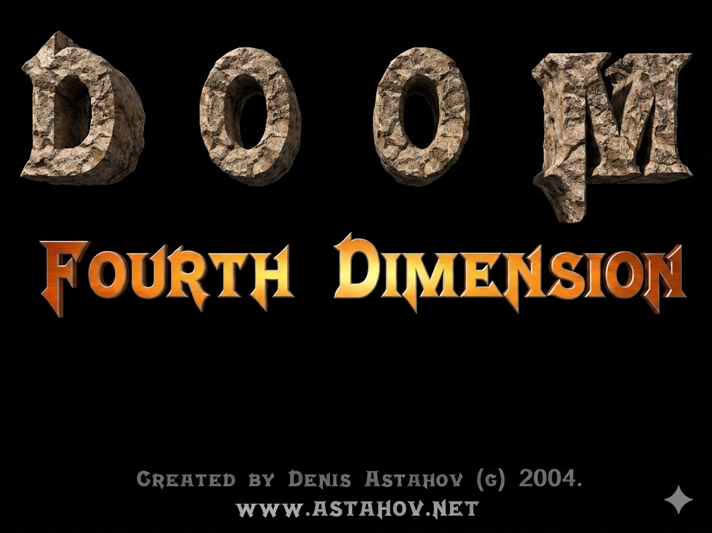

# DOOM 4D - Remastered (Python Port)

> Originally created by **Denis Astahov (ADV-IT)** in 2004 as a Bachelor Degree project.  
> **Score: 95/100** 🏆

This is a modern Python/Pygame port of the original Visual Basic 6 + DirectX 7 game. Cross-platform, open source, and remastered for modern systems.



## 🎮 About

DOOM 4D is a 3D first-person shooter where you battle a computer-controlled enemy across two arenas:
- **Earth** 🌍 - Green landscapes, peaceful trees
- **Hell** 🔥 - Dark realm, fire and smoke

## 🚀 Quick Start

```bash
# Clone the repo
git clone https://github.com/adv4000/doom4d-remastered.git
cd doom4d-remastered

# Install dependencies
pip install -r requirements.txt

# Run the game
python doom4d.py
```

## 🎯 Controls

| Key | Action |
|-----|--------|
| `↑` / `↓` | Move forward/backward |
| `←` / `→` | Rotate left/right |
| `SPACE` | Shoot |
| `N` | New game (after game over) |
| `ESC` | Exit |

## 🛠️ Technical Details

### Original (2004)
- **Language:** Visual Basic 6
- **Graphics:** DirectX 7 (DirectDraw, Direct3D)
- **Sound:** DirectSound, MCI
- **Platform:** Windows only

### Remastered (2024)
- **Language:** Python 3
- **Graphics:** Pygame
- **Platform:** Windows, macOS, Linux

## 📁 Project Structure

```
doom4d-remastered/
├── doom4d.py          # Main game file
├── requirements.txt   # Python dependencies
├── README.md          # This file
├── Image/             # Textures and sprites
│   ├── Earth/         # Earth arena textures
│   └── Death/         # Hell arena textures
├── Sound/             # Sound effects
└── Music/             # Background music
```

## 🏆 Original Project

- **Author:** Denis Astahov (ADV-IT)
- **Year:** 2004
- **Score:** 95/100
- **Original Repo:** [adv4000/doom4d](https://github.com/adv4000/doom4d)

## 📜 License

This project preserves the original license from the VB6 version. See [LICENSE](LICENSE) for details.

---

*Made with ❤️ for preserving gaming history*
